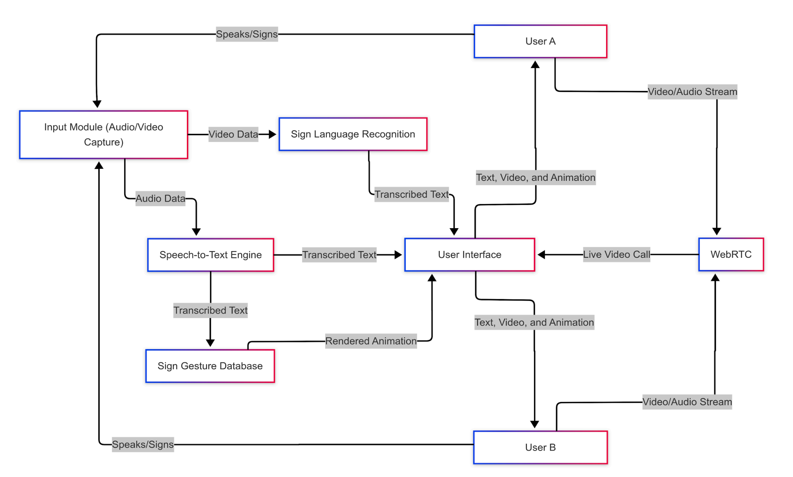

# Two-Way Speech-Sign Communication Platform

An intelligent, real-time, bidirectional communication platform designed to bridge the gap between speech-/hearing-impaired individuals using **Indian Sign Language (ISL)** and spoken English speakers during live video calls.

---

## Executive Summary

Traditional assistive technologies are often one-way (speech-to-text only or gesture recognition only) or rely heavily on human interpreters. This project provides a modular, low-latency, two-way communication system embedded within a WebRTC video conferencing interface.

* Speech-to-Sign: Converts live spoken English into grammatically structured Indian Sign Language (ISL) rendered via a 3D avatar using SiGML (Signing Gesture Markup Language).
* Sign-to-Speech: Captures live ISL gestures from a webcam, extracts keypoints with MediaPipe, classifies dynamic gestures using a CNN-LSTM neural network, and synthesizes natural audio output using Coqui TTS.

---

## ✨ Key Features

- 🎙️ **Real-Time Speech-to-Text (Vosk ASR)**: Offline-capable speech recognition fine-tuned with the LibriSpeech dataset for low-latency, privacy-conscious transcription.
- 🧠 **NLP English-to-ISL Grammar Engine**:
  - Reorders English **Subject-Verb-Object (SVO)** structure into ISL **Subject-Object-Verb (SOV)** syntax.
  - Removes redundant articles (*a, an, the*) and auxiliary verbs (*is, are, was, were*).
  - Lemmatizes verbs and handles out-of-vocabulary fallback via **fingerspelling**.
- 👤 **3D Avatar & SiGML Player**: Renders signing gestures based on **HamNoSys** (Hamburg Notation System) standards with speed and playback controls.
- 🖐️ **AI Sign Gesture Recognition**:
  - MediaPipe Holistic keypoint extraction (21 3D landmarks per hand).
  - Spatial-temporal gesture classification using a hybrid **Conv1D + CNN-LSTM** model on 20-frame sliding windows.
- 🔊 **Text-to-Speech Synthesis (Coqui TTS)**: Converts translated sign text back into natural sounding speech in real time.
- 📹 **Integrated WebRTC Video Conferencing**: P2P video and audio call room with synchronized live captions, sign animations, and voice synthesis overlays.

---

## 📐 System Architecture

---

## 🛠️ Tech Stack & Microservices

| Component | Technology / Library | Description |
| :--- | :--- | :--- |
| **Frontend UI** | Next.js (React), WebRTC, HTML5/CSS3 | P2P video conferencing window, model toggles, controls |
| **Backend APIs** | Python, Flask Microservices | Modular REST / WebSocket endpoints hosting AI models |
| **Speech-to-Text** | Vosk ASR, LibriSpeech | Real-time offline speech transcription |
| **NLP Pipeline** | NLTK, Stanza, WordNet Lemmatizer | Tokenization, POS tagging, lemmatization & SVO→SOV transformation |
| **Sign Animation** | SiGML, HamNoSys, JAS/SiGML Player | XML-based gesture notation rendered on 3D avatar |
| **Gesture Extraction**| MediaPipe Holistic, OpenCV | 21 3D hand landmark coordinates per hand (126 features total) |
| **Gesture Classifier**| TensorFlow / Keras (Conv1D + LSTM) | Spatio-temporal model trained on 20-frame gesture sequences |
| **Speech Synthesis** | Coqui TTS | Neural text-to-speech engine for natural audio output |

---

## 📊 Model Architecture Details (SLR)

The Sign Language Recognition model uses a hybrid **Convolutional 1D + Recurrent (LSTM)** neural network:

1. **Input Layer**: `(20, 126)` — 20 consecutive frames of 126 landmark features (63 per hand).
2. **Conv1D Layer**: 64 filters, kernel size 3 — captures local frame-to-frame spatial transitions.
3. **MaxPooling1D Layer**: Downsamples temporal dimensions.
4. **LSTM Layer 1**: 128 units with `return_sequences=True` — captures sequential dependencies.
5. **LSTM Layer 2**: 256 units — summarizes the gesture timeline.
6. **Dense Output Layer**: Softmax activation across target ISL classes.

---

## 👥 Contributors & Acknowledgments

**Project Team:**
* **Hrishikesh Bhatt** (Enrollment: 211B139) - [hrishi1402@gmail.com](mailto:hrishi1402@gmail.com)
* **Pankaj Kumar Kushwaha** (Enrollment: 211B201) - [pankajkumarkushwaha242@gmail.com](mailto:pankajkumarkushwaha242@gmail.com)
* **Shivam Tripathi** (Enrollment: 211B293) - [shivam1705of@gmail.com](mailto:shivam1705of@gmail.com)

**Supervised By:**
* **Dr. Amit Kumar Srivastava**

**Institution:**
* Department of Computer Science & Engineering  
  **Jaypee University of Engineering & Technology (JUET), Guna, M.P., India** (May 2025)

---

## 📄 License

This project is licensed under the MIT License.